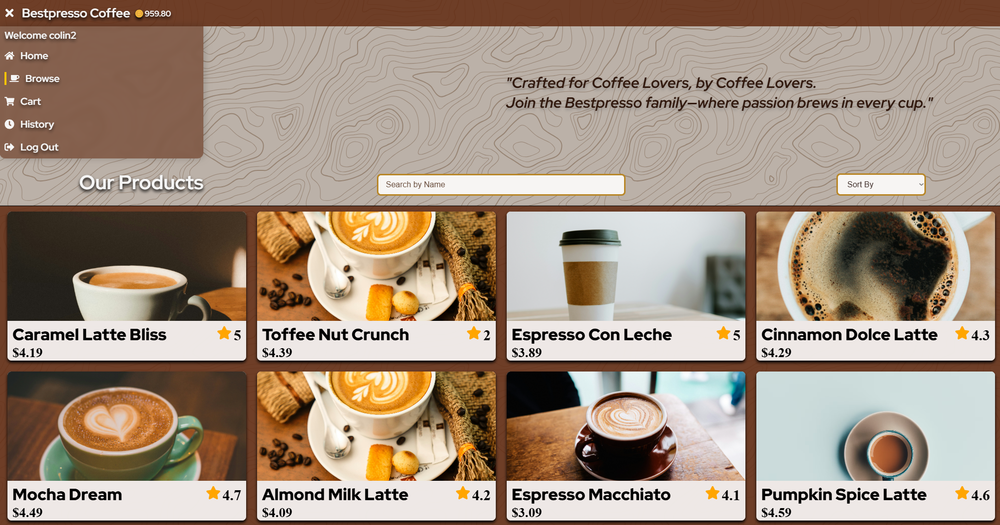
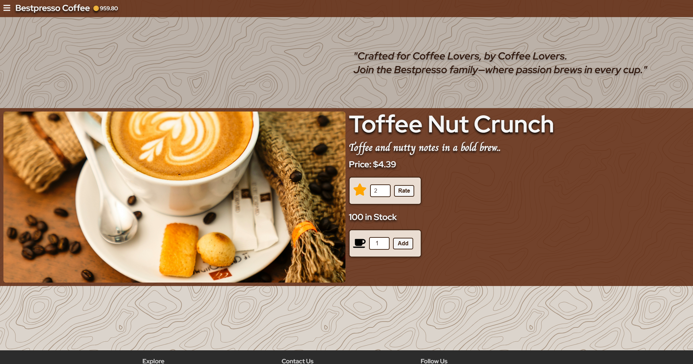

# Bestpresso Frontend




## About Bestpresso

Bestpresso is your go-to online store for premium coffee blends, designed for coffee enthusiasts who value quality and convenience. Built with Flask and React, it delivers a responsive and intuitive interface for browsing with fun stylized animations. It also includes a paginated product list (9 products per page), viewing product details, managing a cart, rating products, and signing in/out. Each product displays a consistent local photo (randomly assigned once on the backend). I created Bestpresso as a learning expericance to dive into the world of e-commerce and digital marketplaces.

Deployed Site: https://bestpresso.netlify.app

## Getting Started

- **Deployed App**: Bestpresso
- **Frontend Repository**: bestpresso-frontend
- **Backend Repository**: flask-api-bestpresso-back-end
- **Planning Materials**: Trello Board

To run locally:

1. Clone the repo:

   ```bash
   git clone https://github.com/yourusername/bestpresso-frontend.git
   cd bestpresso-frontend
   ```

2. Install dependencies:

   ```bash
   npm install
   ```

3. Set up environment variables (`.env`):

   ```
   REACT_APP_API_URL=http://localhost:5000
   ```

4. Start the app:

   ```bash
   npm start
   ```

5. Access at `http://localhost:3000`.

## Attributions

- Unsplash: Coffee photos used during development (now served from backend).
- React Router: Client-side routing.

## Technologies Used

- **JavaScript**: Core language.
- **React**: Frontend framework.
- **React Router**: For navigation and pagination.
- **Axios**: API calls to backend.
- **Netlify**: Deployment platform.
- **CSS**: Basic styling for product grid and pagination.
- **Framer-Motion / Motion One**: Animations.
- **React-Toastify**: Notifications.
- **React-Icons**: Icons.

## Next Steps

- **Cart Enhancements**: Display cart summary on all pages.
- **Wishlist**: Allow users to save products for later.
- **Recomendations**: Add recomendations of similar products to users when they are checking out.